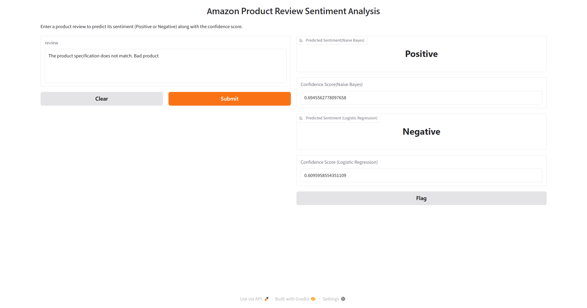

## Amazon Review Classification App

#### Project Overview: 
This project develops a machine learning model to predict the review sentiment based on previous review sentiment.

#### The project includes:
1. Exploratory Data Analysis (EDA)
2. Feature selection
3. Model training and evaluation
4. Hyperparameter experimentation
5. Model comparison
6. Deployment using Gradio


## Dataset

#### Dataset Features

| Feature | Description |
|----------|-------------|
| **reviewText** | Review written by customer |
| **Positive** | Sentiment of the review |

## Dataset Summary:
- Total Records: 20,000
- Missing Values: None
- Positive Review    15,233
- Negative Review     4,767

## Exploratory Data Analysis (EDA)
#### Key Findings
## Top Positive Features

| Rank | Feature | Coefficient |
|------|---------|------------:|
| 1 | love | 8.695 |
| 2 | great | 8.376 |
| 3 | easy | 5.328 |
| 4 | fun | 4.734 |
| 5 | awesome | 4.705 |
| 6 | best | 4.640 |
| 7 | works | 4.385 |
| 8 | nice | 3.234 |
| 9 | amazing | 2.970 |
| 10 | can | 2.929 |

## Top Negative Features

| Rank | Feature | Coefficient |
|------|---------|------------:|
| 1 | not | -7.240 |
| 2 | waste | -5.483 |
| 3 | deleted | -4.701 |
| 4 | uninstalled | -4.395 |
| 5 | sucks | -4.132 |
| 6 | boring | -4.033 |
| 7 | stupid | -3.963 |
| 8 | useless | -3.671 |
| 9 | dont | -3.584 |
| 10 | worst | -3.561 |

## Model Comparison


| Model | Accuracy | Negative Precision | Negative Recall | Negative F1 | Positive Precision | Positive Recall | Positive F1 |
|---------|---------:|---------:|---------:|---------:|---------:|---------:|---------:|
| Naive Bayes | 0.8333 | 0.93 | 0.33 | 0.48 | 0.82 | 0.99 | 0.90 |
| Logistic Regression | **0.8918** | 0.86 | 0.65 | 0.74 | 0.90 | 0.97 | 0.93 |


## Key Findings

- Logistic Regression outperformed Naive Bayes with an accuracy of **89.18%** compared to **83.33%**.
- Logistic Regression achieved significantly better performance on the **Negative** class, increasing recall from **0.33** to **0.65**.
- Naive Bayes showed very high recall (**0.99**) for Positive reviews but struggled to identify Negative reviews correctly.
- Logistic Regression provided a more balanced performance across both sentiment classes.
- The higher F1-scores achieved by Logistic Regression indicate better overall classification capability.
- Based on accuracy, recall, and F1-score, **Logistic Regression was selected as the final model**.


## 🏆 Best Model

| Metric | Value |
|---------|---------|
| Model | Logistic Regression |
| Accuracy | **0.8918** |
| Negative Class F1-Score | **0.74** |
| Positive Class F1-Score | **0.93** |

After evaluating two machine learning algorithms, **Logistic Regression** was selected as the best-performing model.<br>


## Project Structure

```text
House-Price-Prediction/
│
├── data/
│   └── amazon.csv
│
├── notebooks/
│   ├── 1_eda.ipynb
│   └── 2_training.ipynb
│
├── models/
│   └── naive_bayes_model.pkl
    └── logistic_regression_model.pkl
│
├── screenshots/
│   └── gradio_interface.png
│
├── app.py
├── requirements.txt
└── README.md
```


## Gradio Web Application

The project includes a Gradio interface where users can:<br>

- Enter a review
- Classify the sentiment of that review with confidence score

#### Input Features
- Review Text

#### Output
- Predicted Sentiment
- Confidence Score

## 📸 Screenshots

#### Gradio Interface




## Installation

#### Clone the repository:
git clone https://github.com/rotoncsedu/amazon-review-sentiment-analysis <br>
cd amazon-review-sentiment-analysis

#### Install dependencies:

pip install -r requirements.txt

## Run the Application

python app.py<br>

Or launch the Gradio interface:<br>

interface.launch(share=True)

## Technologies Used
- Python
- Pandas , NumPy , Matplotlib , Seaborn
- nltk
- Scikit - learn
- Gradio

## 👨‍💻 Author

Md. Al-Imran Roton

Programmer, Begum Rokeya University, Rangpur

Machine Learning & AI Enthusiast